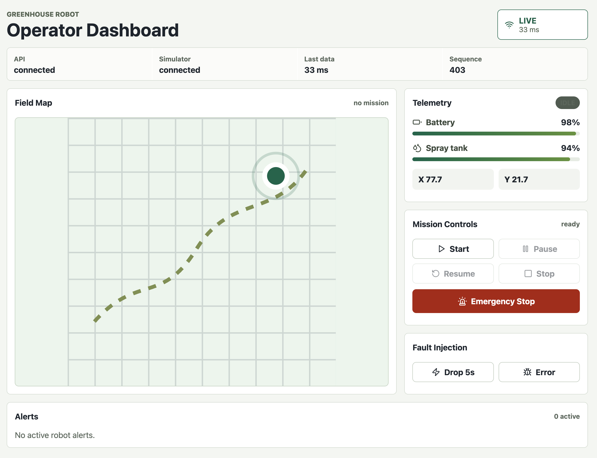
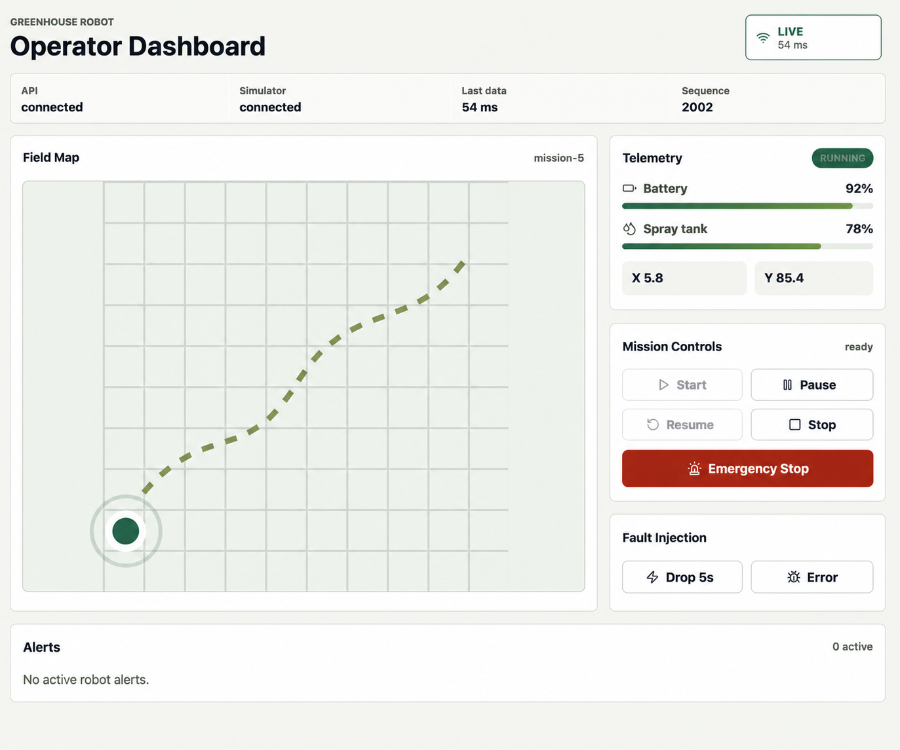
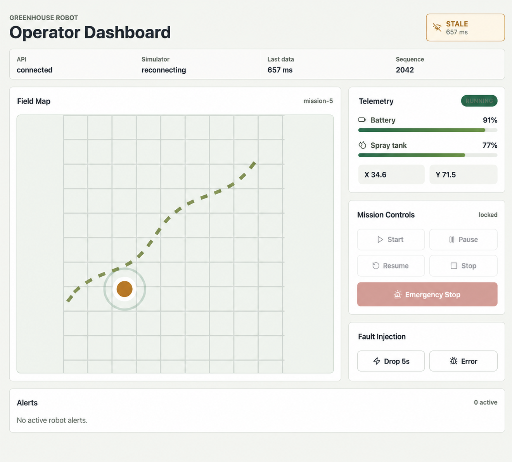
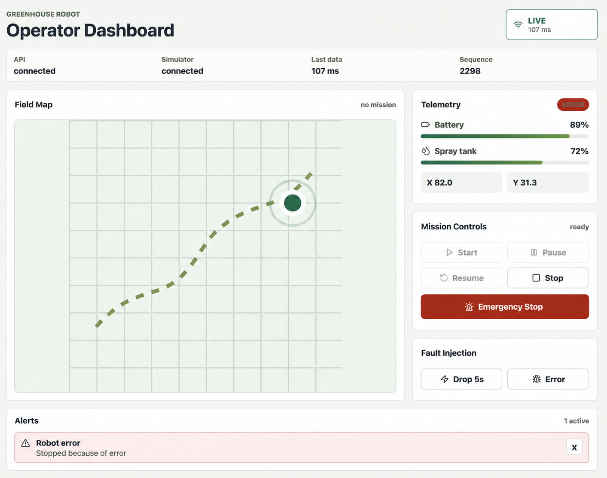
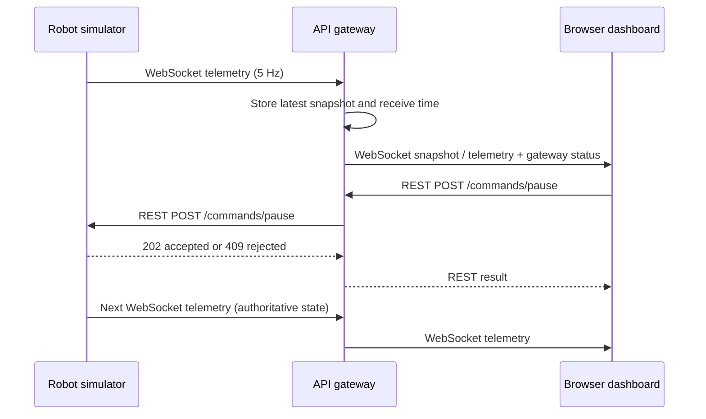

# Greenhouse Robot Operator Dashboard

Full-stack take-home assessment for a simulated greenhouse robot. The main design goal is operator safety: live telemetry must be visually different from stale or disconnected data, and mission controls must lock when the link is unsafe.

## Run

```bash
docker compose up --build
```

Open the dashboard at `http://localhost:4030`.

Services:

- Simulator: `http://localhost:4010`
- API gateway: `http://localhost:4020`
- Dashboard: `http://localhost:4030`

## Dashboard States

The dashboard makes the operator-visible safety states explicit: a healthy ready state,
an active mission, an upstream telemetry outage that locks controls, and a robot fault
with an actionable alert.

<p align="center">
  
  
</p>
<p align="center">
  <em>LIVE and ready</em> &nbsp;&nbsp;&nbsp;&nbsp; <em>LIVE with an active mission</em>
</p>

<p align="center">
  
  
</p>
<p align="center">
  <em>STALE: last known data remains visible while controls lock</em> &nbsp;&nbsp;&nbsp;&nbsp; <em>Robot error with an actionable alert</em>
</p>

## Local Development

```bash
corepack enable
pnpm install
pnpm dev
```

Useful commands:

```bash
pnpm test
pnpm build
pnpm typecheck
```

## Demo Faults

Trigger a five-second simulator connection drop:

```bash
curl -X POST http://localhost:4020/faults/drop-connection \
  -H 'content-type: application/json' \
  -d '{"seconds":5}'
```

Put the robot into error state:

```bash
curl -X POST http://localhost:4020/faults/error
```

## Architecture

The project is intentionally split into three apps and one shared protocol package:

- `apps/simulator`: owns robot state, command transitions, telemetry generation, and simulator fault injection.
- `apps/api`: connects to the simulator, reconnects automatically, exposes REST mission commands, and pushes browser WebSocket updates.
- `apps/web`: React operator dashboard with live/stale/disconnected states, telemetry map, controls, and dismissible alerts.
- `packages/shared`: command names, telemetry shapes, gateway messages, and URL path mappings.

This split keeps the simulator replaceable. For a real ROS2 robot, the API gateway is the adapter boundary: the simulator telemetry link would be replaced by a `rosbridge_server` integration while the browser contract stays stable.

### Request and Telemetry Flows



REST is used for mission commands because each command has a finite outcome the caller needs to handle: accepted, rejected due to an invalid state, or unavailable. WebSockets are used for telemetry because it is a server-driven stream where many small updates should reach every dashboard without polling. The dashboard never treats a successful REST response as proof of the new state; it waits for the follow-up telemetry event.

## Connection Model

The gateway initiates one WebSocket handshake to the simulator's `/telemetry` endpoint. The simulator accepts that connection and pushes telemetry through the established link at roughly 5 Hz. It is full-duplex at the protocol level, but this application reserves it for simulator → gateway telemetry; mission commands use the simulator's HTTP endpoints instead.

Each browser tab separately initiates a WebSocket connection to the gateway's `/ws` endpoint. The API records the latest telemetry snapshot and sends it to a browser immediately when that browser connects. The dashboard derives:

- `LIVE`: browser socket is connected, API is connected to the simulator, and telemetry is fresh.
- `STALE`: the API is reachable, but simulator telemetry stopped or the latest data is older than the freshness threshold.
- `DISCONNECTED`: the browser cannot reach the API WebSocket.

Mission controls are disabled outside `LIVE`. This is the most important product behavior in the assessment because silent stale data would be unsafe for an operator.

`Last data` is the age of the most recent telemetry received by the browser, adjusted using the gateway's reported receive time. It should stay close to zero while the stream is healthy. `Sequence` is a monotonically increasing heartbeat counter: it advances even while the robot is idle or paused, so a changing sequence proves the stream is alive; it is not a mission progress counter.

## Mission Commands

REST endpoints are exposed by the API:

- `POST /commands/start-mission`
- `POST /commands/pause`
- `POST /commands/resume`
- `POST /commands/stop`
- `POST /commands/emergency-stop`

The simulator accepts normal mission transitions and rejects unsafe transitions, for example pausing while idle.

## Tests

Backend tests cover:

- Simulator command state transitions.
- Unsafe command rejection.
- Emergency stop behavior.
- API disconnect/reconnect flow, including stale connection notification and resumed telemetry.


